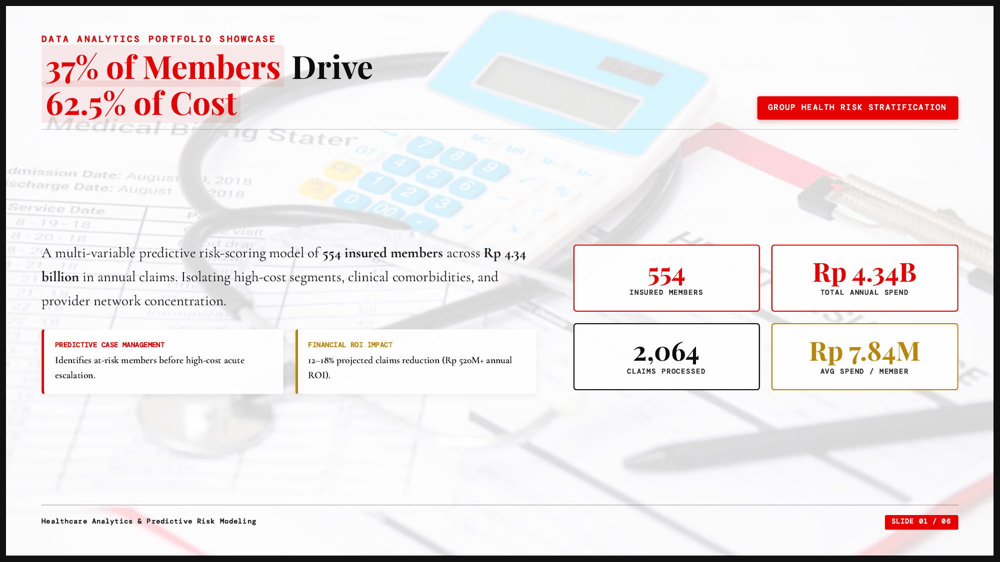
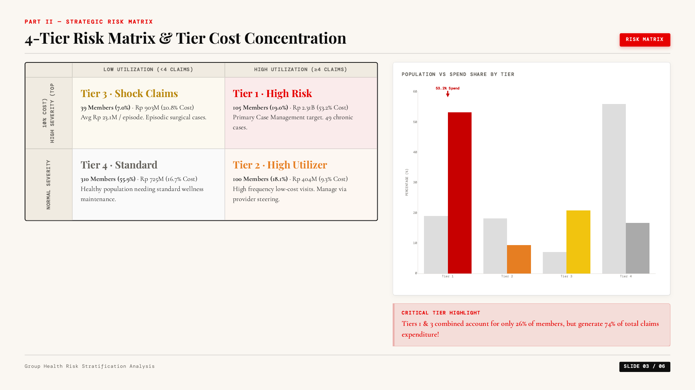
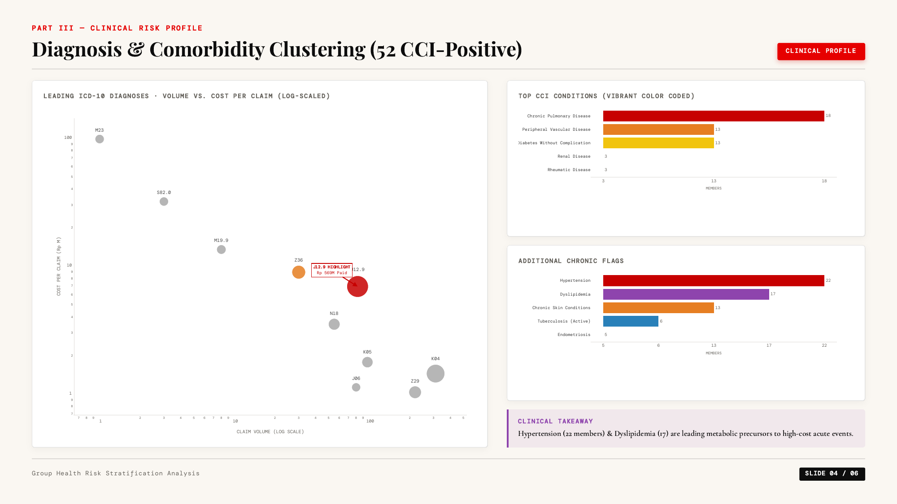

# Healthcare Risk Stratification Framework

### A Decision Intelligence Case Study for Group Health Insurance

> Transforming healthcare claims into actionable intervention strategies through risk stratification, clinical analytics, and cost concentration modeling.

<p align="center">

[](<Showcase/[Storytelling%20Risk%20Startification.html](https://kristianto.pages.dev/)>)
[](Showcase/Risk_Stratification.pdf)
[](#license)

</p>

---

# Executive Summary

Healthcare claims are **not normally distributed**.

A relatively small group of members consistently generates a disproportionate share of healthcare expenditure, yet traditional utilization reports often hide this pattern behind portfolio averages.

This project develops a **risk stratification framework** that combines claim utilization, financial severity, chronic disease burden, and clinical complexity into actionable intervention tiers for population health management.

Across **554 insured members**, the framework identifies the members driving financial risk, recommends targeted intervention strategies, and estimates potential cost reduction through structured care management.

---

# Dashboard Preview

<p align="center">

</p>

<p align="center">

</p>

<p align="center">

</p>

---

# Business Questions

Instead of asking

> "How much did we spend?"

this project asks

- Which members generate most healthcare expenditure?
- Which clinical conditions predict future cost?
- Which providers should be reviewed?
- Which members require immediate intervention?
- How should intervention resources be prioritized?
- What financial impact can be expected?

---

# Key Results

| Metric                  |                                Result |
| ----------------------- | ------------------------------------: |
| Population              |                 **554 Members** |
| Total Claims            |                **2,064 Claims** |
| Annual Spend            |             **Rp 4.34 Billion** |
| High Risk Population    |                         **19%** |
| Spend Concentration     |                       **53.2%** |
| High Cost Population    | **37% generate 62.5% of spend** |
| Estimated Annual Saving |                    **Rp 520M+** |
| Estimated ROI           |                       **3 : 1** |

---

# Business Impact

The framework demonstrates that targeted intervention is substantially more effective than portfolio-wide programs.

Key operational recommendations include

- Dedicated case management for Tier 1 members
- Chronic disease outreach for high-risk members
- Provider network optimization
- Clinical referral management
- Precision-based intervention prioritization
- Longitudinal population monitoring

---

# Methodology

```
Claims Data
        │
        ▼
Data Cleaning
        │
        ▼
Feature Engineering
        │
        ▼
Composite Risk Scoring
        │
        ▼
Clinical Classification
        │
        ▼
Risk Tier Segmentation
        │
        ▼
Provider Analysis
        │
        ▼
Intervention Roadmap
```

---

## Risk Scoring

The composite score combines

- Annual Claims Paid
- Claim Frequency
- Inpatient Admission
- Charlson Comorbidity Index
- Chronic Disease Flags

```
Risk Score

↓

Tier 1 — High Risk

Tier 2 — High Utilizer

Tier 3 — Shock Claim

Tier 4 — Standard Population
```

---

## Clinical Analytics

The framework incorporates

- ICD-10 diagnosis mapping
- Charlson Comorbidity Index (CCI)
- Chronic disease identification
- High-cost inpatient utilization
- Benefit utilization analysis

---

## Provider Analytics

Provider evaluation considers

- Claim volume
- Total paid amount
- Cost concentration
- Geographic utilization
- Referral optimization opportunities

---

## Model Evaluation

Classification performance is evaluated through

- Precision
- Recall
- F1 Score
- Threshold Sensitivity

Rather than maximizing accuracy alone, the operating threshold balances intervention capacity against missed high-risk members.

---

# Technology Stack

| Category        | Technology              |
| --------------- | ----------------------- |
| Analysis        | Python                  |
| Data Processing | Pandas                  |
| Statistics      | NumPy                   |
| Visualization   | Plotly                  |
| Mapping         | Leaflet                 |
| Frontend        | HTML / CSS / JavaScript |
| Dataset         | JSON                    |

---

# Repository Structure

```
Healthcare-Risk-Stratification/
│
├── Showcase/
│     ├── Risk_Stratification.pdf
│     ├── Presenting Risk Startification.html
│     ├── carousel_presentation.html
│     └── data.js
│
├── images/
│     ├── overview.png
│     ├── risk-matrix.png
│     ├── diagnosis.png
│     └── provider-network.png
│
└── README.md
```

---

# Business Outcomes

The proposed intervention strategy is expected to achieve

- 12–18% reduction in annual healthcare expenditure
- Rp 520M+ projected annual savings
- Estimated intervention ROI of 3:1
- Improved prioritization of clinical outreach
- Reduced unnecessary inpatient utilization
- Better provider negotiation opportunities

---

# Limitations

This project represents a portfolio case study.

Current limitations include

- Single employer population
- One-year observation period
- No pharmacy claims
- No laboratory measurements
- No mortality outcomes
- No real-time claim ingestion

---

# Future Enhancements

Planned extensions include

- Dynamic Risk Score
- Time-to-event (Survival Analysis)
- Readmission Prediction
- Provider Quality Index
- Explainable AI (SHAP)
- Automated Risk Monitoring
- Real-time Dashboard
- Care Management Tracking

---

# Live Showcase

Interactive Demonstration

👉 [**Presenting Risk Stratification**](https://kristianto.pages.dev/projects/risk-stratification/)

Executive Presentation

👉 [**PDF Slide Deck**](Showcase/Risk_Stratification.pdf)

---

# Author

## Kristianto

Healthcare Analytics · Data Analytics · Insurance Intelligence

[GitHub](https://github.com/Kristianto06) · [LinkedIn](https://linkedin.com/in/kristianto06) · [Portfolio](https://kristianto.pages.dev)

---

> *Data creates value only when it changes decisions. This project demonstrates how healthcare analytics can translate claims data into measurable operational action.*
